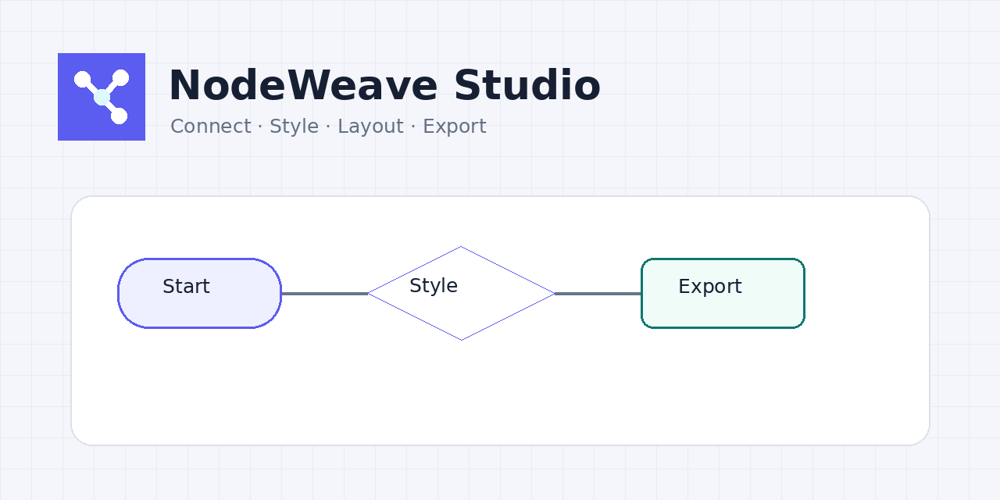

# NodeWeave Studio

<p align="center">
  <strong>SVG-first, local-first diagram editor for connected flows, system maps, mind maps, and reusable visual structures.</strong>
</p>

<p align="center">
  <a href="https://ko9ma7.github.io/nodeweave-studio/"><strong>Live Demo</strong></a>
  ·
  <a href="https://github.com/ko9ma7/nodeweave-studio/issues">Report a Bug</a>
  ·
  <a href="https://github.com/ko9ma7/nodeweave-studio/issues">Request a Feature</a>
</p>

<p align="center">
  <a href="https://github.com/ko9ma7/nodeweave-studio/actions/workflows/deploy.yml"></a>
  <a href="./LICENSE"></a>
  
  
</p>



**NodeWeave Studio** is a browser-native diagram workspace built around a canonical SVG document model. It lets you connect shapes quickly, search reusable diagram primitives, apply style tokens across many elements at once, auto-arrange flows, save projects locally, and export the same diagram as SVG, PNG, WebP, HTML, or JSON.

한국어 요약: **노드·커넥터 편집, 검색 가능한 도형/템플릿, 스타일 토큰 일괄 변경, 자동 레이아웃, 로컬 저장, SVG/PNG/WebP/HTML/JSON 내보내기를 한 화면에서 처리하는 다이어그램 편집기입니다.**

## Why NodeWeave

Most diagram tools mix document structure, visual style, and export behavior too tightly. NodeWeave separates them:

```text
Diagram document
├─ nodes
├─ edges
├─ tokens
├─ viewport
└─ settings

Visual system
├─ shape catalog
├─ theme presets
├─ templates
└─ export pipeline
```

That separation makes the editor easy to extend: a new shape can immediately participate in existing themes, layout commands, selection tools, and export formats without becoming a one-off component.

## Highlights

- **SVG-native editing** — nodes, labels, ports, and connectors share one vector-first document model.
- **Fast connected flows** — create straight, Bézier, or orthogonal connectors directly from node ports.
- **Expanded shape library** — 30+ flow, data, architecture, annotation, media, and container primitives.
- **Reusable SVG symbols** — 30+ built-in `currentColor` SVG symbols for people, systems, devices, security, status, communication, and content.
- **External SVG workflow** — paste, drop, or import user-supplied SVG assets, then recolor, rotate, flip, resize, and add backgrounds.
- **Reusable templates** — 14 starters covering product flows, incident response, data pipelines, auth, customer journeys, org charts, network topology, releases, and more.
- **Design-token styling** — change canvas, surface, primary, text, border, edge, radius, and typography values globally.
- **Batch editing** — multi-select nodes and apply fill, stroke, text, width, font size, and radius changes together.
- **Auto layout** — arrange flows left-to-right or top-to-bottom and use alignment/distribution tools for cleanup.
- **Portable exports** — SVG, PNG, WebP, standalone HTML, and JSON from the same source document.
- **Local-first persistence** — autosave and named projects stay in the browser; no account or backend is required.
- **GitHub Pages ready** — dependency-free runtime, static build, PWA shell, SEO metadata, 404 page, and Actions deployment.

## Editor capabilities

### Canvas and selection

- Drag and resize nodes
- Marquee selection and multi-selection
- Duplicate and delete selections
- Copy/paste selections with internal connector preservation
- Bring selected nodes to front or send them behind other nodes
- Keyboard nudge with fine/grid increments
- Pan with `Space + drag`
- Pointer-centered wheel zoom
- Fit view and minimap
- Optional grid and snap-to-grid

### Connectors

- Port-to-port connection creation
- Straight routing
- Bézier routing
- Orthogonal routing
- Arrow markers and theme-aware stroke styling

### Layout

- Left → Right flow layout
- Top → Bottom flow layout
- Align left / center / right
- Align top / middle / bottom
- Horizontal and vertical distribution
- Configurable spacing

### Themes and tokens

Built-in presets include:

- Minimal
- Blueprint
- Paper
- Soft
- Dark
- High Contrast

Shape type and visual style are intentionally independent, so the same diagram structure can be restyled without rebuilding it.

### Project storage

- Browser autosave
- Up to 20 named local projects
- JSON import/export for portable backups
- Theme preference persistence

### SVG assets and icon workflows

NodeWeave includes its own small **NodeWeave Symbols** set built from simple `currentColor` SVG primitives. Imported SVG assets are treated as editable diagram objects rather than as a bundled third-party icon library.

Supported SVG asset workflows:

- Click or drag a built-in SVG symbol onto the canvas
- Drag an `.svg` file directly onto the canvas
- Import an SVG file from Project management
- Paste raw `<svg>…</svg>` markup using the SVG asset dialog
- Paste SVG markup directly on the canvas with the system clipboard
- Optional single-color normalization to `currentColor`
- Recolor `currentColor`, rotate, flip horizontally/vertically, resize, adjust inner padding, and add/remove an icon background
- Preserve an optional source URL with imported SVG metadata

#### Koboyo Icons

[Koboyo Icons](https://koboyo.com/icons) is useful as an external place to discover a large variety of SVG concepts. NodeWeave provides a **link-out + user import** workflow rather than bundling or mirroring Koboyo's icon collection. This is intentional because NodeWeave is itself a diagram editor; users should review the current upstream license before importing third-party assets.

### Import and export

| Format | Purpose |
| --- | --- |
| SVG | Editable vector output and design-tool handoff |
| PNG | General raster image export |
| WebP | Smaller raster output for web publishing |
| HTML | Standalone embeddable diagram document |
| JSON | Lossless NodeWeave project backup/import |

PNG/WebP export supports multiple scale factors for higher-resolution output.

## Keyboard shortcuts

| Shortcut | Action |
| --- | --- |
| `Ctrl/⌘ K` | Command search |
| `Ctrl/⌘ Z` | Undo |
| `Ctrl/⌘ Shift Z` or `Ctrl/⌘ Y` | Redo |
| `Ctrl/⌘ A` | Select all nodes |
| `Ctrl/⌘ C` | Copy selected nodes and internal connectors |
| `Ctrl/⌘ V` | Paste NodeWeave selection or raw SVG markup |
| `Ctrl/⌘ D` | Duplicate selected nodes |
| `Ctrl/⌘ S` | Save named browser project |
| `Delete` / `Backspace` | Delete selection |
| `Enter` | Edit selected node text |
| Arrow keys | Nudge selected nodes |
| `Shift` + Arrow keys | Nudge by grid size |
| `Space` + drag | Pan canvas |
| Mouse wheel | Zoom around pointer |
| `Shift` + click | Add/remove nodes from selection |

## Privacy and security

NodeWeave does not send diagram content to an application server. Autosave and named project data use browser storage.

Custom SVG import and paste use an allowlist-oriented sanitizer before imported markup is inserted into the editor. Script elements, event-handler attributes, and unsafe external references are not intended to pass through the import path. If you extend the importer, keep sanitization and CSP-style thinking in the threat model rather than treating SVG as a passive image format.

## Accessibility

The editor uses semantic buttons/forms/dialogs, keyboard shortcuts, focus-visible styling, reduced-motion handling, accessible labels, and SVG `title`/`desc` metadata in exports. Interactive SVG nodes are keyboard-focusable.

The project targets WCAG 2.2 principles, but any production fork should still run automated and manual accessibility testing against its own content, extensions, and browser support matrix.

## Tech stack

- HTML5
- CSS3
- JavaScript ES modules
- Native SVG
- Canvas API for PNG/WebP raster export
- LocalStorage
- Service Worker + Web App Manifest
- Node.js built-in modules for local build/check/dev scripts
- GitHub Actions + GitHub Pages

**Runtime npm dependencies: 0**

## Project structure

```text
/
├─ .github/
│  ├─ ISSUE_TEMPLATE/
│  └─ workflows/deploy.yml
├─ assets/                 # favicon, PWA icons, OG/social preview
├─ docs/                   # architecture, research decisions, repo settings
├─ examples/               # portable NodeWeave project example
├─ scripts/
│  ├─ build.mjs            # static dist builder + canonical URL injection
│  ├─ check.mjs            # JS syntax / asset / metadata checks
│  └─ serve.mjs            # dependency-free local dev server
├─ src/
│  ├─ app.js               # editor state + interaction controller
│  ├─ catalog.js           # shapes, themes, templates
│  ├─ export.js            # SVG/PNG/WebP/HTML/JSON export
│  ├─ geometry.js          # SVG shapes, text layout, edge routing
│  ├─ storage.js           # local persistence
│  └─ styles.css           # UI system + responsive layout
├─ 404.html
├─ CHANGELOG.md
├─ CONTRIBUTING.md
├─ LICENSE
├─ README.md
├─ SECURITY.md
├─ github-bootstrap.cmd
├─ index.html
├─ manifest.webmanifest
├─ package.json
├─ site.config.json
└─ sw.js
```

## Local development

Requirements: Node.js 20+.

```bash
npm run dev
```

Open `http://localhost:4173/`.

No `npm install` is required because the project has no package dependencies.

## Build and verification

```bash
npm run build
npm run check
```

The deployable static site is written to `dist/`.

The build script injects the canonical deployment URL into metadata. To override it locally:

```bash
SITE_URL=https://example.com npm run build
```

On GitHub Actions, the public project-site URL is derived from `GITHUB_REPOSITORY` automatically.

## GitHub Pages deployment

The repository is configured for:

```text
git push main
   ↓
GitHub Actions
   ↓
npm run build
   ↓
npm run check
   ↓
Pages artifact
   ↓
GitHub Pages
```

Target deployment URL:

**https://ko9ma7.github.io/nodeweave-studio/**

The workflow is defined in `.github/workflows/deploy.yml`.

### Windows bootstrap

`github-bootstrap.cmd` is an idempotent setup script for Windows 10/11. It can:

- verify Git, Node.js, npm, and GitHub CLI
- authenticate with GitHub if needed
- initialize the local Git repository
- create `ko9ma7/nodeweave-studio` when missing
- configure repository description, homepage, topics, and repository options
- build and validate the project
- push `main`
- enable GitHub Pages with Actions
- watch the deployment workflow
- create the current `v1.1.0` tag

It does not contain or require a hard-coded GitHub token.

## Repository metadata

Canonical public metadata for this project:

| Field | Value |
| --- | --- |
| Repository | `ko9ma7/nodeweave-studio` |
| Description | `SVG-first, local-first diagram editor with design tokens, auto layout, and SVG/PNG/WebP/HTML/JSON export.` |
| Website | `https://ko9ma7.github.io/nodeweave-studio/` |
| Visibility | Public |
| Default branch | `main` |
| License | MIT |
| Release | `v1.0.0` |

Recommended topics:

`diagram-editor` · `svg-editor` · `flowchart` · `diagram` · `svg` · `local-first` · `github-pages` · `design-tool` · `mind-map` · `system-design` · `auto-layout` · `pwa` · `javascript` · `no-dependencies`

See [`docs/github-repository-settings.md`](./docs/github-repository-settings.md) for the full repository settings checklist.

## Configuration

`site.config.json` contains public site metadata.

Diagram behavior and built-in content live in `src/catalog.js`:

- `SHAPES` — shape metadata and search keywords
- `THEMES` — visual token presets
- `TEMPLATES` — starter diagrams
- `DEFAULT_SETTINGS` — grid/layout/export defaults

## Custom domain

For a custom domain:

1. Add the domain in **Settings → Pages → Custom domain**.
2. Configure the required DNS records at your DNS provider.
3. Enable **Enforce HTTPS** after DNS validation.
4. Set `SITE_URL=https://your-domain.example` during build if canonical/OG/sitemap URLs should use that domain.

A `CNAME` file is intentionally omitted until a real custom domain is selected.

## Contributing

Bug reports and focused feature proposals are welcome. See [CONTRIBUTING.md](./CONTRIBUTING.md).

For security-sensitive reports, use the process in [SECURITY.md](./SECURITY.md) rather than opening a public issue.

## Roadmap

Likely next-stage additions include:

- layer and grouping workflows
- obstacle-aware orthogonal routing
- more advanced graph-layout engines
- Mermaid / PlantUML import
- PDF export
- IndexedDB persistence for larger projects
- persistent custom shape libraries
- document history/version snapshots
- optional collaborative/cloud persistence adapters

## License

NodeWeave Studio is available under the [MIT License](./LICENSE).

Generated diagrams belong to their creators. Any third-party icon, shape, font, or library added later must retain its original license and attribution; this repository's MIT license does not override third-party terms.
